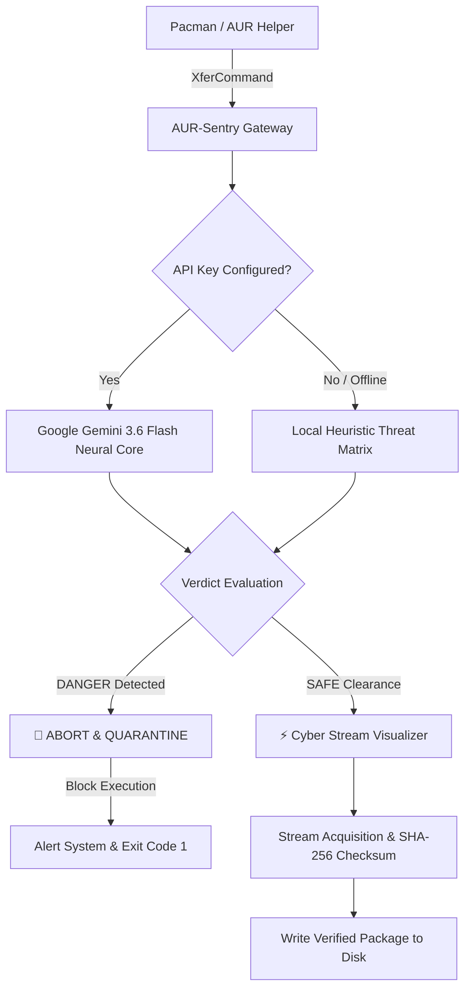

<p align="center">
  
</p>

<div align="center">

# 🛡️ AUR-SENTRY
### *Next-Gen AI Security Sentinel & Cyberpunk Terminal Visualizer for Arch Linux*

[](https://archlinux.org)
[](https://deepmind.google/technologies/gemini/)
[](https://www.gnu.org/software/bash/)
[](LICENSE)
[]()

<br/>

[Key Features](#-key-features) •
[Architecture](#-architecture) •
[Quick Start](#-quick-start) •
[Gemini AI Setup](#-google-gemini-ai-configuration) •
[CLI Usage](#-cli-usage--commands) •
[Pacman Integration](#-pacman-integration) •
[Test Suite](#-test-suite)

</div>

---

## 🌌 Overview

**AUR-Sentry** is an ultra-low latency command-line security agent and animated cyber visualizer engineered specifically for **Arch Linux**, **Pacman**, and the **Arch User Repository (AUR)**. 

Powered by **Google Gemini 3.6 Flash** and an offline heuristic fallback matrix, **AUR-Sentry** performs real-time threat intelligence scans on incoming packages before they are written to disk. It detects and quarantines supply-chain trojans, typosquatted packages, backdoor `systemd` persistence hooks, and token grabbers — all while providing an immersive cyberpunk download interface.

---

## 🌟 Key Features

| Feature | Description |
| :--- | :--- |
| 🧠 **Neural AI Threat Intelligence** | Direct integration with **Google Gemini 3.6 Flash** for instantaneous threat classification (`[SAFE]` vs `[DANGER]`). |
| 🚨 **Supply-Chain & Typosquatting Defense** | Intercepts *Atomic Arch* trojans, *Chaos RAT* vectors, orphaned maintainer account hijackings, and homoglyph exploits. |
| ⚡ **Cyber Stream Visualizer** | High-precision animated progress gauges, glowing gradient meters, dynamic spinners, and real-time transfer telemetry. |
| 🔁 **Smart Session Caching** | Detects active terminal sessions to display the ASCII boot banner only once during multi-package operations (`pacman -Syu`). |
| 🔒 **Resilient Signature Handling** | Handles missing `.sig` files (HTTP 404) gracefully with zero corrupt temporary files left on disk. |
| 📴 **Offline Heuristic Matrix** | Automatic failover to local heuristic pattern-matching engine if offline or if cloud API limits are hit. |
| 🛠️ **Native Pacman `XferCommand` Hook** | Seamlessly drops into `/etc/pacman.conf` without modifying Pacman binaries or breaking pacman hooks. |

---

## 🏗️ Architecture



---

## 🚀 Quick Start

### 1. Clone the Repository
```bash
git clone https://github.com/Arunachalam-gojosaturo/aur-sentry.git
cd aur-sentry
```

### 2. Automated Installation
Run the installer with root privileges to configure `/etc/pacman.conf` and link binaries to `/usr/local/bin/`:
```bash
sudo ./install.sh
```

### 3. Verify the Installation
Run the complete automated 6-step test suite:
```bash
./test.sh
```

---

## 🔑 Google Gemini AI Configuration

AUR-Sentry leverages **Google Gemini 3.6 Flash** for neural package analysis.

### Set Your API Key:
```bash
# Save securely in ~/.config/aur-sentry/api_key (chmod 600)
aur-sentry --set-key "AIzaSyYourGeminiApiKeyHere..."
```

### Manage API Key:
```bash
# Check current API key status
aur-sentry --show-key

# Remove saved API key
aur-sentry --clear-key
```

> [!TIP]
> You can also supply the API key via environment variable:
> ```bash
> export GEMINI_API_KEY="AIzaSyYourGeminiApiKeyHere..."
> export GEMINI_MODEL="gemini-3.6-flash" # Optional
> ```

---

## 💻 CLI Usage & Commands

AUR-Sentry can be invoked directly as a standalone security scanner or as a replacement download accelerator.

```
Usage: aur-sentry [OPTIONS] <URL_OR_PACKAGE_NAME>

Options:
  --scan-only            Perform AI security scan without initiating download
  --set-key <KEY>        Save Google Gemini API key securely
  --show-key             Display active API key status (masked)
  --clear-key            Remove saved Gemini API key
  --banner, --art        Force display of ASCII startup art
  -o, --output <path>    Specify destination output file path
  -h, --help             Show help documentation

Environment Variables:
  GEMINI_API_KEY         Provide Gemini API key directly via shell
  GEMINI_MODEL           Override AI model (Default: gemini-3.6-flash)
```

### Examples:

#### 🔍 Scan an Official Package:
```bash
aur-sentry "neovim" --scan-only
```
```
┌────────────────────────────────────────────────────────┐
│ 🛡️  AUR-SENTRY NEURAL SENTINEL :: THREAT CORE           │
└────────────────────────────────────────────────────────┘
  TARGET PACKAGE : neovim
  INTEL SOURCE   : Google Gemini 3.6 Flash (Live Cloud AI)

  [✓] AUR-Sentry is thinking... Initializing neural threat weights
  [✓] AUR-Sentry is scanning repository provenance & cryptographic keys
  [✓] AUR-Sentry neural core analyzing typosquatting & homoglyph matrices
  [✓] AUR-Sentry received verified neural verdict from Gemini AI.

┌────────────────────────────────────────────────────────┐
│ 🛡️  AUR-SENTRY :: SECURITY CLEARANCE GRANTED           │
└────────────────────────────────────────────────────────┘
[SAFE] Official Neovim text editor distribution with verified maintainer cryptographic provenance.
```

#### 🚨 Intercept a Malicious Typosquatted Package:
```bash
aur-sentry "firefox-patch-bin" --scan-only
```
```
┌────────────────────────────────────────────────────────┐
│ 🚨 AUR-SENTRY :: CRITICAL THREAT DETECTED              │
└────────────────────────────────────────────────────────┘
[DANGER] High-risk supply chain threat identified matching the Atomic Arch typosquatting campaign; embedded payload contains unauthorized credential harvest hooks and backdoor systemd persistence.
```

---

## ⚙️ Pacman Integration

`install.sh` automatically updates `/etc/pacman.conf` with optimized visual and security parameters:

```ini
[options]
Color
ILoveCandy
CheckSpace
XferCommand = /usr/local/bin/arcxos-dl %u -o %o
# ParallelDownloads = 5 (Disabled for high-precision sequential stream visualization)
```

To use the full AI-Sentry engine directly inside pacman:
```ini
XferCommand = /usr/local/bin/aur-sentry %u -o %o
```

---

## 🧪 Test Suite

Run the built-in test suite to validate all 6 core submodules:

```bash
./test.sh
```

| Test Case | Target | Expected Result |
| :--- | :--- | :--- |
| `TEST 1` | ASCII Boot Sequence | Art renders on fresh session |
| `TEST 2` | Session Caching | Art suppressed during sequential transfers |
| `TEST 3` | Safe Package Scan | Returns `[SAFE]` clearance |
| `TEST 4` | Typosquat Detection | Returns `[DANGER]` and blocks download |
| `TEST 5` | Supply-Chain Trojan | Returns `[DANGER]` for backdoor hooks |
| `TEST 6` | Missing 404 `.sig` | Clean exit with zero disk artifacts |

---

## 📁 Repository Structure

```
aur-sentry/
├── banner.jpeg         # Repository header banner graphic
├── aur-sentry          # Core Gemini AI security agent & visualizer
├── arcxos-dl           # High-performance animated pacman downloader
├── arcxos-hyper-dl     # Hyper-stream variant with extended telemetry
├── hyperdl.sh          # Session-cached transfer utility
├── pacman.conf         # Pre-configured Arch Linux pacman configuration
├── install.sh          # Automated system installer & backup tool
├── uninstall.sh        # Complete uninstaller & configuration restorer
├── test.sh             # Comprehensive 6-step test & evaluation suite
└── README.md           # Documentation & user guide
```

---

## 🗑️ Uninstallation

To restore your original `/etc/pacman.conf` and remove all binaries from `/usr/local/bin`:

```bash
sudo ./uninstall.sh
```

---

## 📜 License

Distributed under the **MIT License**. See `LICENSE` for more information.

---

<div align="center">
  <sub>Developed by <a href="https://github.com/Arunachalam-gojosaturo">Arunachalam</a> • Powered by Google Gemini AI & Arch Linux</sub>
</div>
