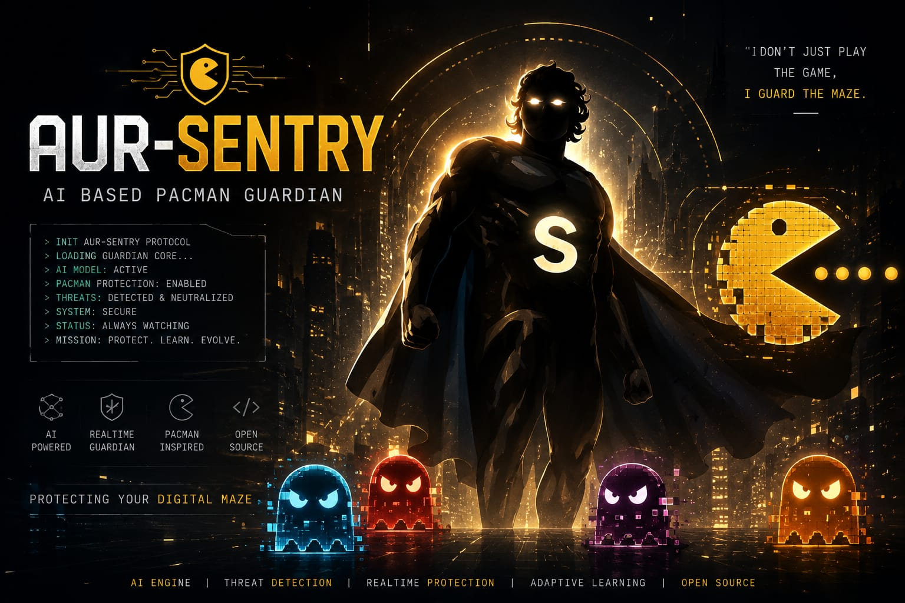
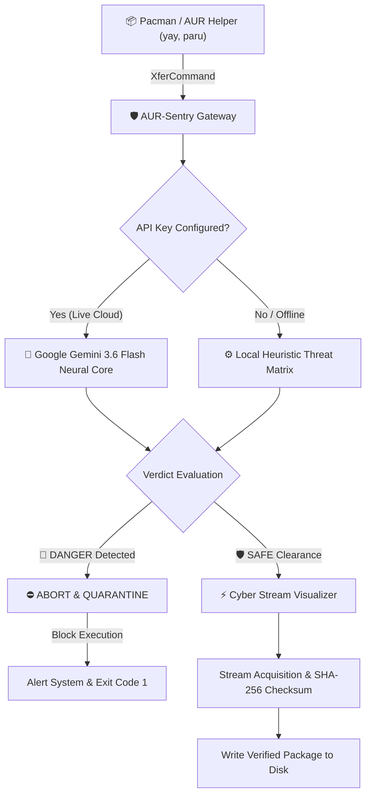

<p align="center">
  
</p>

<div align="center">

# 🛡️ AUR-SENTRY
### *First AI-based pacman security agent and animated cyber visualizer for Arch Linux, developed by Arunachalam*

[](https://aur.archlinux.org/packages/aur-sentry)
[](https://archlinux.org)
[](https://deepmind.google/technologies/gemini/)
[](https://www.gnu.org/software/bash/)
[](https://aur.archlinux.org/account/arunachalam)
[](LICENSE)

<br/>

**[AUR Package](https://aur.archlinux.org/packages/aur-sentry)** •
**[Maintainer Profile](https://aur.archlinux.org/account/arunachalam)** •
**[Key Features](#-key-features)** •
**[Architecture](#-architecture)** •
**[Installation](#-installation)** •
**[Gemini AI Setup](#-google-gemini-ai-configuration)** •
**[CLI Usage](#-cli-usage--commands)** •
**[Pacman Integration](#-pacman-integration)** •
**[Test Suite](#-test-suite)**

</div>

---

## 🌌 Overview

**Arunachalam's AUR-Sentry** is an ultra-low latency command-line security agent and animated cyber visualizer engineered specifically for **Arch Linux**, **Pacman**, and the **Arch User Repository (AUR)**. Developed by a 7-year veteran builder based in **Tamil Nadu, India**.

As the **first AI-based pacman installer security system for Arch Linux**, **AUR-Sentry** combines real-time threat intelligence powered by **Google Gemini 3.6 Flash** with a high-performance terminal visualizer. It intercepts and evaluates incoming packages before they touch system memory or disk, eliminating supply-chain attacks, typosquatted clones, backdoor `systemd` persistence hooks, token grabbers, and malicious maintainer takeovers.

---

## 🌟 Key Features

| Feature | Description |
| :--- | :--- |
| 🧠 **Neural AI Threat Intelligence** | Direct real-time classification using **Google Gemini 3.6 Flash** (`[SAFE]` vs `[DANGER]`). |
| 🚨 **Supply-Chain & Typosquatting Shield** | Stops *Atomic Arch* trojans, *Chaos RAT* vectors, orphaned maintainer account takeovers, and homoglyph exploits. |
| ⚡ **Cyber Stream Visualizer** | High-precision animated progress meters, glowing gradient gauges, dynamic spinners, and real-time telemetry. |
| 🔁 **Smart Session Caching** | Suppresses redundant startup animations on sequential downloads during batch `pacman -Syu` operations. |
| 🔒 **404 Signature Resiliency** | Handles missing `.sig` files cleanly without creating corrupted zero-byte files on disk. |
| 📴 **Dual-Engine Failover** | Instant offline fallback to a local heuristic threat matrix if internet connectivity or API quota drops. |
| 🛠️ **Seamless Pacman `XferCommand` Hook** | Native integration via `/etc/pacman.conf` without patching Pacman binaries. |

---

## 🏗️ Architecture



---

## 🚀 Installation

### Option 1: Install from AUR (Recommended)

Using **`yay`**:
```bash
yay -S aur-sentry
```

Using **`paru`**:
```bash
paru -S aur-sentry
```

Manual AUR build:
```bash
git clone https://aur.archlinux.org/aur-sentry.git
cd aur-sentry
makepkg -si
```

---

### Option 2: Install from Source (GitHub)

```bash
git clone https://github.com/Arunachalam-gojosaturo/aur-sentry.git
cd aur-sentry
sudo ./install.sh
```

---

## 🔑 Google Gemini AI Configuration

AUR-Sentry uses **Google Gemini 3.6 Flash** for neural package security analysis.

### Set Your API Key:
```bash
# Save securely to ~/.config/aur-sentry/api_key (mode 600)
aur-sentry --set-key "AIzaSyYourGeminiApiKeyHere..."
```

### Manage API Key:
```bash
# Display active API key status (masked)
aur-sentry --show-key

# Remove saved API key
aur-sentry --clear-key
```

> [!TIP]
> You can also supply the API key via environment variable:
> ```bash
> export GEMINI_API_KEY="AIzaSyYourGeminiApiKeyHere..."
> export GEMINI_MODEL="gemini-3.6-flash" # Optional (Default: gemini-3.6-flash)
> ```

---

## 💻 CLI Usage & Commands

```
Usage: aur-sentry [OPTIONS] <URL_OR_PACKAGE_NAME>

Options:
  --scan-only            Perform AI security scan without downloading
  --set-key <KEY>        Save Google Gemini API key securely
  --show-key             Display active API key status
  --clear-key            Remove saved Gemini API key
  --banner, --art        Force display of ASCII startup art
  -o, --output <path>    Specify destination output file path
  -h, --help             Show help documentation

Environment Variables:
  GEMINI_API_KEY         Set Gemini API key via environment
  GEMINI_MODEL           Override AI model (Default: gemini-3.6-flash)
```

### Interactive Examples:

#### 🔍 Scan an Official Package:
```bash
aur-sentry "neovim" --scan-only
```
```
┌────────────────────────────────────────────────────────┐
│ 🛡️  AUR-SENTRY NEURAL SENTINEL :: THREAT CORE           │
└────────────────────────────────────────────────────────┘
  TARGET PACKAGE : neovim
  INTEL SOURCE   : Google Gemini 3.6 Flash (Live Cloud AI)

  [✓] AUR-Sentry is thinking... Initializing neural threat weights
  [✓] AUR-Sentry is scanning repository provenance & cryptographic keys
  [✓] AUR-Sentry neural core analyzing typosquatting & homoglyph matrices
  [✓] AUR-Sentry received verified neural verdict from Gemini AI.

┌────────────────────────────────────────────────────────┐
│ 🛡️  AUR-SENTRY :: SECURITY CLEARANCE GRANTED           │
└────────────────────────────────────────────────────────┘
[SAFE] Official Neovim text editor distribution with verified maintainer cryptographic provenance.
```

#### 🚨 Intercept a Malicious Typosquatted Threat:
```bash
aur-sentry "firefox-patch-bin" --scan-only
```
```
┌────────────────────────────────────────────────────────┐
│ 🚨 AUR-SENTRY :: CRITICAL THREAT DETECTED              │
└────────────────────────────────────────────────────────┘
[DANGER] High-risk supply chain threat identified matching the Atomic Arch typosquatting campaign; embedded payload contains unauthorized credential harvest hooks and backdoor systemd persistence.
```

---

## ⚙️ Pacman Integration

To route all pacman package transfers through AUR-Sentry visualizers or the AI shield, configure `/etc/pacman.conf`:

```ini
[options]
Color
ILoveCandy
CheckSpace
# Fast Cyberpunk Visualizer:
XferCommand = /usr/bin/arcxos-dl %u -o %o

# OR Full AI Neural Threat Interceptor:
# XferCommand = /usr/bin/aur-sentry %u -o %o

# Sequential download stream for animated visualizer:
# ParallelDownloads = 5
```

---

## 🧪 Test Suite

Run the built-in 6-phase test suite to verify all subsystem components:

```bash
./test.sh
```

| Phase | Subsystem | Verification |
| :--- | :--- | :--- |
| `TEST 1` | ASCII Boot Sequence | Art renders on fresh session |
| `TEST 2` | Session Caching | Banner suppressed during continuous batch transfers |
| `TEST 3` | Official Package Scan | Returns `[SAFE]` clearance |
| `TEST 4` | Typosquat Detection | Returns `[DANGER]` and blocks download |
| `TEST 5` | Supply-Chain Trojan | Returns `[DANGER]` for unauthorized systemd backdoors |
| `TEST 6` | 404 Missing Signature | Clean exit with zero disk contamination |

---

## 📁 Repository Structure

```
aur-sentry/
├── banner.jpeg         # Header banner graphic
├── PKGBUILD            # Arch Linux / AUR package build recipe
├── .SRCINFO            # Generated AUR package metadata
├── aur-sentry.install  # Post-install hooks & helpful guide
├── aur-sentry          # Core Gemini AI security agent & visualizer
├── arcxos-dl           # High-performance animated pacman downloader
├── arcxos-hyper-dl     # Hyper-stream telemetry downloader
├── hyperdl.sh          # Session-cached transfer utility
├── pacman.conf         # Pre-configured Arch Linux pacman configuration
├── install.sh          # Standalone system installer & backup tool
├── uninstall.sh        # Complete uninstaller & configuration restorer
├── test.sh             # Comprehensive 6-step test suite
├── LICENSE             # MIT License
└── README.md           # Documentation & user guide
```

---

## 🗑️ Uninstallation

```bash
# If installed via yay/pacman:
sudo pacman -R aur-sentry

# If installed via install.sh:
sudo ./uninstall.sh
```

---

## 👤 Author & Maintainer

- **Arunachalam** (Veteran Builder, Tamil Nadu, India)
- **AUR Account**: [https://aur.archlinux.org/account/arunachalam](https://aur.archlinux.org/account/arunachalam)
- **GitHub**: [@Arunachalam-gojosaturo](https://github.com/Arunachalam-gojosaturo)

---

## 📜 License

Distributed under the **MIT License**. See [`LICENSE`](LICENSE) for details.
